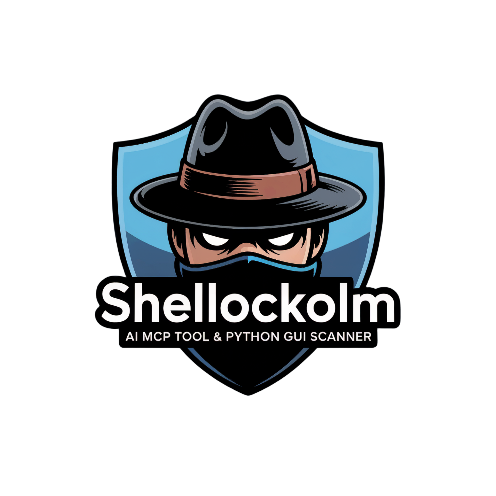

<div align="center">



# Shellockolm

**Security Detective for React, Next.js, Node.js & npm**

*Elementary, my dear developer!* Detect CVEs, malware, secrets, and supply chain attacks in seconds.

[](https://www.python.org/downloads/)
[](LICENSE)
[](https://github.com/hlsitechio/shellockolm/releases/latest)

</div>

---

## Quick Install

```bash
git clone https://github.com/hlsitechio/shellockolm.git
cd shellockolm
pip install -r requirements.txt
python src/cli.py
```

That's it. No build step, no node_modules, no config files. The interactive shell launches automatically.

---

## Why Python?

Shellockolm scans JavaScript/Node.js projects **from the outside** — it doesn't execute your code, it inspects it. Python was chosen deliberately:

- **No conflict with the target.** A Node.js scanner running inside `node_modules` is scanning itself. Python sits outside the blast radius — no shared dependencies, no version conflicts, no `postinstall` hooks firing during analysis.
- **No supply chain risk to the scanner.** Your security tool shouldn't depend on the same ecosystem it's auditing. Zero npm dependencies means zero chance of a compromised transitive dep infecting the scanner itself.
- **Rich CLI out of the box.** Python's [Rich](https://github.com/Textualize/rich) library gives us formatted tables, progress bars, colored output, and panels with no frontend build pipeline.
- **Cross-platform without transpilation.** Works on Linux, macOS, and Windows with a single `pip install`. No `esbuild`, no bundler, no `node_modules` directory.
- **Fast enough for static analysis.** Shellockolm reads `package.json`, lockfiles, and source patterns — it doesn't need V8's JIT. Python's I/O and regex performance is more than sufficient for file scanning.

---

## What It Does

| Scanner | What It Detects | Coverage |
|---------|----------------|----------|
| **React RSC** | Server Components RCE, source code exposure, DoS | CVE-2025-55182, CVE-2025-66478, CVE-2025-55183, CVE-2025-55184, CVE-2025-67779 |
| **Next.js** | Middleware authorization bypass, RSC vulnerabilities | CVE-2025-29927, CVE-2025-66478 |
| **npm Packages** | RCE in mysql2, jsonpath-plus; DoS in body-parser, multer | CVE-2024-21508, CVE-2024-21534, CVE-2025-1302, CVE-2024-45590, + more |
| **Node.js Runtime** | HTTP/2 crash, TLS memory leak, permission model bypass | CVE-2025-59465, CVE-2025-59464, CVE-2025-59466, + 6 more |
| **n8n** | Ni8mare unauthenticated RCE, expression injection | CVE-2026-21858, CVE-2025-68613, CVE-2025-68668 |
| **Supply Chain** | Shai-Hulud worm, eslint-config-prettier compromise, typosquatting | CVE-2025-54313 + 10 campaign CVEs |
| **Clawdbot/Moltbot** | AI gateway credential leaks, OAuth piggybacking, mDNS exposure, auth bypass | CLAWDBOT-AUTH-BYPASS, CLAWDBOT-PLAINTEXT-CREDS, CLAWDBOT-PROMPT-RCE, CLAWDBOT-QSTRING-AUTH |
| **Malware Scanner** | Obfuscated code, cryptominers, backdoors, data exfiltration | 100+ detection patterns |
| **Secrets Scanner** | API keys, tokens, credentials, high-entropy strings | AWS, GitHub, Slack, Stripe, 50+ patterns |

**32 unique CVEs** tracked across 7 specialized scanners, plus malware and secrets detection.

---

## Usage

### Interactive Shell (Recommended)

```bash
python src/cli.py
```

Launches a menu-driven interface with 60+ commands organized into categories. Type a number or letter to run any command.

### CLI Commands

```bash
# Scan current directory with all scanners
python src/cli.py scan

# Scan a specific directory
python src/cli.py scan /path/to/project

# Scan with a specific scanner (react, nextjs, npm, nodejs, n8n, supply-chain, clawdbot)
python src/cli.py scan /path --scanner nextjs

# Scan for Clawdbot/Moltbot credential leaks
python src/cli.py scan --scanner clawdbot

# Export results to JSON
python src/cli.py scan /path -o report.json

# Live probe a URL for exploitable vulns
python src/cli.py live https://example.com

# Live probe with specific scanner
python src/cli.py live https://example.com --scanner n8n

# List all tracked CVEs
python src/cli.py cves

# Filter by severity
python src/cli.py cves --severity critical

# Show only bug bounty targets
python src/cli.py cves --bounty

# Get detailed info on a specific CVE
python src/cli.py info CVE-2025-29927

# List available scanners
python src/cli.py scanners

# Start interactive shell explicitly
python src/cli.py shell
```

---

## Complete Command Reference

Every command available in the interactive shell, with what it does.

### Scanning

| Command | Name | What It Does |
|---------|------|-------------|
| `1` | Full Scan | Runs all 7 scanners on a directory to detect 32 CVEs across React, Next.js, Node.js, npm, n8n, supply chain, and Clawdbot/Moltbot. |
| `1a` | Scan ALL npm | Auto-discovers and scans every npm project on your system by finding all `package.json` files. |
| `1b` | Pre-Download Check | Sandbox-installs an npm package to a temp directory, scans it for malware and vulns, then destroys the sandbox. |
| `1c` | Deep Scan | Version checks + code pattern analysis + config inspection — shows step-by-step HOW each vulnerability is detected. |
| `1d` | CVE Hunter | Target a single CVE by ID and see real-time detection output against your project. |
| `1e` | Custom Scan | Pick exactly which scanners to run (toggle React, Next.js, npm, Node.js, n8n, Supply Chain, Clawdbot on/off). |
| `2` | React Scanner | Scan for React Server Components RCE (CVE-2025-55182, CVE-2025-66478). |
| `3` | Next.js Scanner | Scan for Next.js middleware bypass (CVE-2025-29927) and RSC vulnerabilities. |
| `4` | npm Packages | Scan for vulns in mysql2, jsonpath-plus, body-parser, multer, nuxt, AdonisJS. |
| `5` | Node.js Runtime | Scan for Node.js runtime vulnerabilities from the January 2026 security release. |
| `6` | n8n Scanner | Scan for n8n workflow automation vulns including Ni8mare unauthenticated RCE. |
| `7` | Supply Chain | Detect Shai-Hulud worm campaign, eslint-config-prettier compromise, malicious install scripts. |

### Clawdbot / Moltbot

AI gateway credential protection — detects OAuth piggybacking, exposed tokens, mDNS broadcasting, and insecure installations.

| Command | Name | What It Does |
|---------|------|-------------|
| `70` | Full Clawdbot Scan | Run ALL checks: credential files, OAuth piggybacking, installations, network exposure, mDNS broadcasting, package deps. |
| `71` | Home Credential Audit | Quick scan of `~/.claude/`, `~/.clawdbot/`, `~/.moltbot/` for exposed OAuth tokens and insecure file permissions. |
| `72` | OAuth Token Check | Check if Claude Code OAuth tokens in `~/.claude/.credentials.json` are being piggybacked by Clawdbot/Moltbot. |
| `73` | Network Exposure | Check for exposed gateway (port 18789), mDNS broadcasting (port 5353), reverse proxy configs leaking credentials. |
| `74` | Detect Installation | Find Clawdbot/Moltbot: npm global packages, system binaries, cloned repos, running processes, MCP server configs. |
| `75` | Remediation Guide | Step-by-step guide: revoke tokens, fix permissions, block ports, uninstall, audit. |

### Live Probing

| Command | Name | What It Does |
|---------|------|-------------|
| `8` | Probe All | Actively probe a live URL for exploitable vulnerabilities (Next.js + n8n). |
| `9` | Next.js Probe | Test a URL for CVE-2025-29927 middleware bypass via `x-middleware-subrequest` header injection. |
| `10` | n8n Probe | Test a URL for CVE-2026-21858 Ni8mare unauthenticated RCE via Content-Type confusion. |

### CVE Intelligence

| Command | Name | What It Does |
|---------|------|-------------|
| `11` | List All CVEs | Display all 32 tracked CVEs with severity, CVSS scores, and affected packages. |
| `12` | Critical Only | Filter to show only CRITICAL severity CVEs (CVSS 9.0+). |
| `13` | Bug Bounty | List CVEs that are high-value bug bounty targets — critical severity or with public PoCs. |
| `14` | CVE Details | Get full details on a specific CVE: description, affected versions, patches, references. |
| `15` | List Scanners | Show all 7 scanners with their descriptions, CVE coverage, and capabilities. |

### Reports

| Command | Name | What It Does |
|---------|------|-------------|
| `16` | JSON Report | Run a full scan and export results to a JSON file. |

### Malware Analysis

| Command | Name | What It Does |
|---------|------|-------------|
| `17` | Deep Malware Scan | Scan `node_modules` and project files for RCE payloads, backdoors, cryptominers, data exfiltration, and typosquatting. |
| `18` | Quick Malware Scan | Fast scan of project files only (skips `node_modules`) — good for checking your own code for injected malware. |
| `19` | Quarantine File | Move a malicious file to quarantine with original path preserved for potential restoration. |
| `20` | Remove Package | Completely remove a malicious npm package from `node_modules`, backing up to quarantine first. |
| `21` | Clean Malicious Code | Surgically remove only malicious code from a file while preserving legitimate code (creates backup). |
| `22` | View Report | Display the latest malware analysis report with findings, threat levels, and remediation steps. |

### Secrets Scanner

| Command | Name | What It Does |
|---------|------|-------------|
| `23` | Scan for Secrets | Deep scan for API keys, tokens, passwords, AWS credentials, GitHub tokens, Stripe keys, and 50+ patterns. |
| `24` | Scan .env Files | Target `.env` files specifically for hardcoded secrets and credentials. |
| `25` | High Entropy | Use entropy-based detection to find random strings that may be unknown API key formats. |
| `26` | View Report | Display the latest secrets scan report with risk levels and recommendations. |

### Security Score

| Command | Name | What It Does |
|---------|------|-------------|
| `27` | Security Score | Generate a comprehensive A-F security grade analyzing vulns, malware, secrets, deps, and config. |
| `28` | Quick Check | Fast security assessment without deep scanning — good for CI/CD pipelines. |
| `29` | View Report | Display detailed security report with category breakdown and improvement tips. |

### Auto-Fix

| Command | Name | What It Does |
|---------|------|-------------|
| `30` | Auto-Fix | Automatically upgrade vulnerable packages to patched versions (creates backup first). |
| `31` | Preview Fixes | Dry-run showing what packages would be upgraded without making any changes. |
| `32` | Rollback | Restore `package.json` from backup if auto-fix caused issues. |

### Dependency Analysis

| Command | Name | What It Does |
|---------|------|-------------|
| `33` | Analyze Lockfile | Analyze `package-lock.json`, `yarn.lock`, or `pnpm-lock.yaml` for vulnerabilities and issues. |
| `34` | Find Duplicates | Find packages with multiple versions in your lockfile to reduce bundle size. |
| `35` | Typosquatting | Check for packages with suspiciously similar names to popular libraries. |
| `36` | View Report | Display detailed lockfile analysis with all issues and recommendations. |

### SARIF Export

| Command | Name | What It Does |
|---------|------|-------------|
| `37` | Export SARIF | Export scan results to SARIF format for GitHub Code Scanning, VS Code, and CI/CD integration. |
| `38` | View SARIF | View the most recent SARIF report. |
| `39` | Convert Last Scan | Convert the most recent scan results to SARIF without running a new scan. |

### GitHub Advisory

| Command | Name | What It Does |
|---------|------|-------------|
| `40` | Query Package | Query GitHub Advisory Database for known vulnerabilities in a specific npm package. |
| `41` | Check Version | Check if a specific `package@version` is vulnerable using GitHub Advisory Database. |
| `42` | Scan Project | Scan `package.json` dependencies against GitHub Advisory Database. |
| `43` | View Report | Display the most recent GitHub Advisory scan report. |

### npm Audit

| Command | Name | What It Does |
|---------|------|-------------|
| `44` | Run npm audit | Run `npm audit` with enhanced output and formatted results. |
| `45` | npm audit fix | Run `npm audit fix` to automatically patch vulnerabilities. |
| `46` | Recommendations | Get detailed fix recommendations for npm vulnerabilities. |
| `47` | Audit History | View history of previous npm audit scans. |

### SBOM (Software Bill of Materials)

| Command | Name | What It Does |
|---------|------|-------------|
| `48` | Generate SBOM | Generate a Software Bill of Materials in CycloneDX or SPDX format. |
| `49` | CycloneDX | Generate SBOM in CycloneDX 1.4 JSON format (industry standard). |
| `50` | SPDX | Generate SBOM in SPDX 2.3 JSON format (Linux Foundation standard). |

### Dependency Tree

| Command | Name | What It Does |
|---------|------|-------------|
| `51` | View Tree | Display the full dependency tree with Rich formatting. |
| `52` | Find Package | Find all instances of a specific package across the dependency tree. |
| `53` | Tree Stats | Show dependency tree statistics: duplicates, depth, circular references. |
| `54` | Export Tree | Export dependency tree to JSON, DOT, or ASCII format. |

### Ignore Rules

| Command | Name | What It Does |
|---------|------|-------------|
| `55` | Create Ignore | Create a `.shellockolmignore` file with recommended patterns. |
| `56` | View Patterns | Show all loaded ignore patterns (defaults + project + global). |
| `57` | Test Path | Test if a specific path would be ignored by current patterns. |

### CI/CD

| Command | Name | What It Does |
|---------|------|-------------|
| `58` | Generate Workflow | Create a GitHub Actions workflow for automated security scanning. |
| `59` | Basic Workflow | Generate a minimal workflow for quick CI/CD setup. |
| `60` | Full Workflow | Generate a comprehensive workflow with all scan types enabled. |
| `61` | Watch Mode | Start continuous scanning that monitors files for changes. |

### Quick Actions

These are single-letter shortcuts available at any time in the interactive shell:

| Key | Name | What It Does |
|-----|------|-------------|
| `Q` | Quit | Exit the shell. |
| `H` | Help | Show scanner overview, CVE count, and project info. |
| `S` | Star | Open the GitHub repo in your browser to star it. |
| `U` | Update | Refresh CVE database — checks local DB, GitHub Advisory, and NVD. |
| `P` | PoC | Fetch proof-of-concept code for a specific CVE from GitHub and exploit databases. |
| `R` | Report | Interactive report builder — select findings, choose format (Markdown, JSON, HackerOne, Plain Text). |
| `X` | QuickFix | One-shot fix for all detected vulnerabilities — upgrades packages to patched versions. |
| `F` | FixWizard | Step-by-step remediation wizard that walks through each fix with explanations. |
| `L` | Logs | View the current session log. |
| `C` | Clear | Clear the screen. |

---

## Tracked CVEs

| CVE | Severity | CVSS | Package | Description |
|-----|----------|------|---------|-------------|
| CVE-2025-55182 | Critical | 10.0 | React | Server Components RCE via unsafe deserialization (React2Shell) |
| CVE-2025-66478 | Critical | 10.0 | Next.js | Server Components RCE — duplicate of CVE-2025-55182 for Next.js |
| CVE-2025-29927 | Critical | 9.1 | Next.js | Middleware authorization bypass via `x-middleware-subrequest` header |
| CVE-2026-21858 | Critical | 10.0 | n8n | Ni8mare — unauthenticated RCE via Content-Type confusion |
| CVE-2025-68613 | High | — | n8n | Expression injection RCE (authenticated) |
| CVE-2025-68668 | High | — | n8n | Python Code Node RCE |
| CVE-2025-55184 | High | 7.5 | React | Server Components DoS via infinite loop |
| CVE-2025-67779 | High | 7.5 | React | DoS incomplete fix for CVE-2025-55184 |
| CVE-2025-55183 | Medium | 5.3 | React | Server Components source code exposure |
| CVE-2024-21508 | High | — | mysql2 | Remote Code Execution |
| CVE-2024-21534 | High | — | jsonpath-plus | Remote Code Execution |
| CVE-2025-1302 | High | — | jsonpath-plus | RCE (incomplete fix for CVE-2024-21534) |
| CVE-2024-45590 | High | — | body-parser | Denial of Service |
| CVE-2025-48997 | High | — | multer | Denial of Service |
| CVE-2025-47944 | High | — | multer | Multiple issues |
| CVE-2024-34344 | High | — | Nuxt.js | Test mode RCE |
| CVE-2024-13059 | High | — | AnythingLLM | Path traversal |
| CVE-2026-21440 | High | — | AdonisJS | Bodyparser path traversal |
| CVE-2025-54313 | High | — | eslint-config-prettier | Supply chain compromise |
| CVE-2025-59465 | High | — | Node.js | HTTP/2 crash |
| CVE-2025-59464 | High | — | Node.js | TLS memory leak |
| CVE-2025-59466 | High | — | Node.js | async_hooks stack exhaustion |
| CVE-2025-27210 | Medium | — | Node.js | Windows path traversal (device names) |
| CVE-2025-23084 | Medium | — | Node.js | Windows path traversal (drive names) |
| CVE-2024-21891 | High | — | Node.js | Permission model bypass |
| CVE-2025-55130 | High | — | Node.js | Symlink permission bypass |
| CVE-2026-21636 | High | — | Node.js | Unix socket permission bypass |
| CVE-2025-55132 | High | — | Node.js | `fs.futimes` bypass |

---

## Examples

### Scan a Next.js project
```bash
python src/cli.py scan ~/my-nextjs-app --scanner nextjs
```

### Hunt for a specific CVE
```bash
python src/cli.py shell
> 1d
> CVE-2025-29927
> /path/to/project
```

### Live probe a target for middleware bypass
```bash
python src/cli.py live https://target.com --scanner nextjs
```

### Generate SBOM
```bash
python src/cli.py shell
> 48
> /path/to/project
```

### Quick security check and fix
```bash
python src/cli.py shell
> 1
> /path/to/project
> X
```

### Export scan results to JSON
```bash
python src/cli.py scan /path/to/project -o results.json
```

---

## CI/CD Integration

### GitHub Actions

```yaml
- name: Security Scan
  run: |
    pip install -r requirements.txt
    python src/cli.py scan . -o results.json
```

### Pre-commit Hook

```bash
#!/bin/bash
python src/cli.py scan . --scanner npm --quiet
```

---

## Requirements

- Python 3.10+
- pip

**Dependencies** (installed via `pip install -r requirements.txt`):

| Package | Purpose |
|---------|---------|
| `rich` | Terminal formatting, tables, progress bars |
| `typer` | CLI argument parsing and subcommands |
| `packaging` | Version comparison for CVE range matching |
| `semver` | Semantic version parsing |
| `pydantic` | Data validation for scan results |
| `mcp` | MCP server protocol support |
| `aiofiles` | Async file I/O for watch mode |
| `requests` | HTTP requests for live probing and API queries |

Dev dependencies: `pytest`, `pytest-asyncio`

---

## Privacy

- **100% Local** — All scans run on your machine.
- **No Upload** — Your code never leaves your system.
- **No Telemetry** — Zero data collection.
- **Open Source** — Full transparency.

---

## Documentation

- [Quick Start](docs/QUICK_START.md)
- [GitHub Scanner](docs/GITHUB_SCANNER.md)
- [Privacy & Security](PRIVACY_AND_SECURITY.md)
- [Contributing](CONTRIBUTING.md)
- [Changelog](CHANGELOG.md)

---

## Support

- [Issues](https://github.com/hlsitechio/shellockolm/issues)
- [Discussions](https://github.com/hlsitechio/shellockolm/discussions)

---

## License

MIT License — See [LICENSE](LICENSE)

---

<div align="center">

**Security scanning made simple.**

[Get Started](#quick-install) | [All Commands](#complete-command-reference) | [Report Issue](https://github.com/hlsitechio/shellockolm/issues)

</div>
